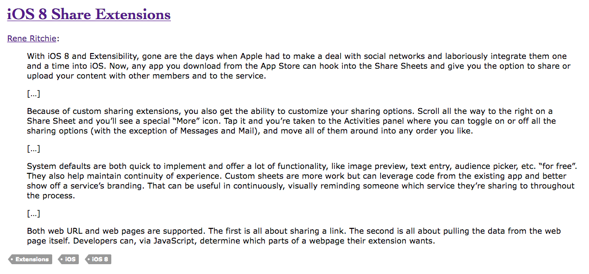
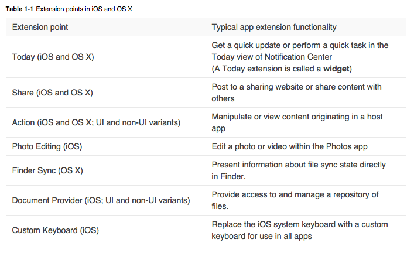
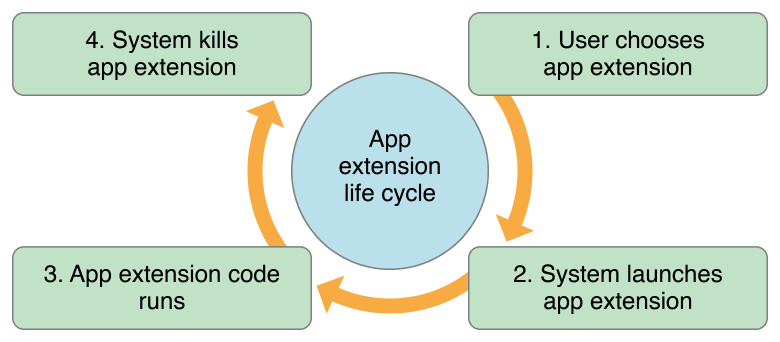
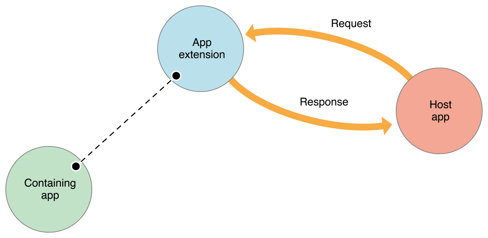
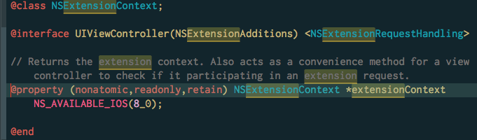

# iOS 8 Share Extension


---


---

# Extension 

---

# Why Extension?


[http://mjtsai.com/blog/2014/07/06/ios-8-share-extensions/](http://mjtsai.com/blog/2014/07/06/ios-8-share-extensions/)

---

# Why Extension?

+ It's all about users experience
+ Drive more app downloads
+ More convenient to use the app
+ Adopt iOS 8
+ Increase user engagement, returns rate
+ WatchKit!

---

# Introduction

+ Starting in iOS 8.0 and OS X v10.10
+ App extension lets you *extend custom functionality and content*
+ Different contexts.
+ An app extension is different from an app.

[from [App Extension Programming Guide](https://developer.apple.com/library/ios/documentation/General/Conceptual/ExtensibilityPG/index.html#//apple_ref/doc/uid/TP40014214-CH20-SW1)]

---

# Extension Point

+ A **system area** that supports extensions is called the **extension point**.
+ Each extension point defines **usage policies** and **provides APIs** that you **use** when you create an extension for that area.
+ You choose an extension point to use based on the functionality you want to provide.

---

# Extension Point



---

# Share extension

---

> Share extensions give users a convenient way to share content with other entities, such as social sharing websites or upload services.
-- [Share extensions](https://developer.apple.com/library/ios/documentation/General/Conceptual/ExtensibilityPG/ShareSheet.html#//apple_ref/doc/uid/TP40014214-CH12-SW1)

Available on both iOS and OS X


---

# How It Works

---

# An App Extension’s Life Cycle

The basic life cycle of an app extension



---

# How an App Extension Communicates

An app extension communicates primarily with its host app, and does so in terms reminiscent of transaction processing: There is a request from the host and a response from the extension. 

---

# How an App Extension Communicates

Following figure shows a simplified view of the relationship between a running extension, the host app that launched it, and the containing app.



---

# Differences

+ Host app and Container app:
	+ Host app is the app that runs your extensions
	+ Container app is the app contains one of more of your extensions.
+ Your container app, like the word phases out, contains and deliver your extension binary.
+ The extension created by adding a **new target**. So as with any target, it specifies settings and files that combine to build a product within your app project.

---

# Creating an extension

Xcode and the documents help you create and deliver App Extensions


---

# Demo Creating an Extension from Xcode

Use Xcode's default template, it provides the extensions point-specific implementation files and settings, and produces a seperate binary that gets added to your containing app's bundle.


---

# Understanding Share Extensions

On both platforms, a Share extension should:

+ Make it easy for users to post content
+ Let users preview, edit, annotate, and configure content, if appropriate
+ Validate the user's content before sending it (use with or without system provided compose view controller)

---

# Capability

If you want to share keychain access between the container app and extension. Check keychain Sharing option in capability tab.

---

# Info.plist

Info.plist file define extension point and other target configuration

```xml
<key>NSExtension</key>
    <dict>
        <key>NSExtensionMainStoryboard</key>
        <string>MainInterface</string>
        <key>NSExtensionPointIdentifier</key>
        <string>com.apple.share-services</string>
</dict>
```

[Declaring Supported Data Types for a Share or Action Extension](https://developer.apple.com/library/ios/documentation/General/Conceptual/ExtensibilityPG/ExtensionScenarios.html#//apple_ref/doc/uid/TP40014214-CH21-SW8)

---

# Context



---

# Extension Context

Starting from iOS 8, in every view controller, there is a [extensionContext](https://developer.apple.com/library/ios/documentation/UIKit/Reference/UIViewController_Class/index.html#//apple_ref/occ/instp/UIViewController/extensionContext) property to get the `NSExtensionContext` object that contains the user's initial text and any attachments for a post, such as links, images, or videos.

---

# NSExtensionContext

```objectivec
//
//  UIViewController.h
//  UIKit
//
//  Copyright (c) 2007-2014 Apple Inc. All rights reserved.
//

@class NSExtensionContext;

@interface UIViewController(NSExtensionAdditions) <NSExtensionRequestHandling>

// Returns the extension context. Also acts as a convenience method 
// for a view controller to check if it participating in an extension request.
@property (nonatomic,readonly,retain) NSExtensionContext *extensionContext NS_AVAILABLE_IOS(8_0);

@end
```

---

# Extension Context

The extension context object also contains information about the status of the posting operation.

(To learn more about how an extension can interact with its context, see [Respond to the Host App’s Request](https://developer.apple.com/library/ios/documentation/General/Conceptual/ExtensibilityPG/ExtensionCreation.html#//apple_ref/doc/uid/TP40014214-CH5-SW3))

---

# Controller

Xcode template default provide the [SLComposeServiceViewController](https://developer.apple.com/library/ios/documentation/Social/Reference/SLComposeServiceViewController_Class/index.html#//apple_ref/occ/cl/SLComposeServiceViewController) object includes a text view that displays the user's editable text content. 

---

# Controller

When a user choose Post, a Share extension validates the text view's content (in addition to attachments, if any) and calls the `completeRequestReturningItems:expirationHandler:completion:` method of `NSExtensionContext`, using code like the following:

```objectivec
NSExtensionItem *outputItem = [[NSExtensionItem alloc] init];
// Set the appropriate value in outputItem
NSArray *outputItems = @[outputItem];
[self.extensionContext completeRequestReturningItems:outputItems expirationHandler:nil completion:nil];
```

---

# Posting Content

The primary purpose of a Share extension is to help users post content.

```objectivec
- (void)didSelectPost {
    // Perform the post operation.
    // When the operation is complete (probably asynchronously), the Share extension
    // should notify the success or failure, as well as the items that were actually shared.
 
    NSExtensionItem *inputItem = self.extensionContext.inputItems.firstObject;
 
    NSExtensionItem *outputItem = [inputItem copy];
    outputItem.attributedContentText = [[NSAttributedString alloc] initWithString:self.contentText attributes:nil];
    // Complete this implementation by setting the appropriate value on the output item.
 
    NSArray *outputItems = @[outputItem];
 
    [self.extensionContext completeRequestReturningItems:outputItems expirationHandler:nil completion:nil];
	// Or call [super didSelectPost] to use the superclass's default completion behavior.
}
```

---

# Demo from the Wusic app


---

# Somethings to Note

---

## Some APIs Are Unavailable to App Extensions

Because of its focused role in the system, an app extension is ineligible to participate in certain activities. An app extension cannot:

+ Access a sharedApplication object, and so cannot use any of the methods on that object
+ Use any API marked in header files with the NS_EXTENSION_UNAVAILABLE macro, or similar unavailability macro, or any API in an unavailable framework

---

## Some APIs Are Unavailable to App Extensions

+ For example, in iOS 8.0, the HealthKit framework and EventKit UI framework are unavailable to app extensions.
+ Access the camera or microphone on an iOS device
+ Perform long-running background tasks

---

## Some APIs Are Unavailable to App Extensions

+ The specifics of this limitation vary by platform, as described in the extension point chapters in this document. (An app extension can initiate uploads or downloads using an NSURLSession object, with results of those operations reported to the containing app.)
+ Receive data using AirDrop
(An app extension can send data using AirDrop in the same way an app does: by employing the UIActivityViewController class.)

---

# Optimize Efficiency and Performance

+ App extensions should feel nimble and lightweight to users.
+ Memory limits for running app extensions are significantly lower than the memory limits imposed on a foreground app.
+ Your app extension doesn’t own the main run loop, so it’s crucial that you follow the established rules for good behavior in main run loops
+ Keep in mind that the GPU is a shared resource in the system.

---

# Summary

+ Creating extension although not an easy task, but fun and you will learn a lot
+ APIs still new and (unfortunately) buggy
+ Beware library architecture
+ UI and auto layout
+ Keychain access group (if want to share keychain between container app and the extension)

---

# Resources

Official
+ [App Extension Programming Guide](https://developer.apple.com/library/ios/documentation/General/Conceptual/ExtensibilityPG/index.html#//apple_ref/doc/uid/TP40014214-CH20-SW1) *****
+ [iOS Human Interface Guidelines](https://developer.apple.com/library/ios/documentation/UserExperience/Conceptual/MobileHIG/index.html#//apple_ref/doc/uid/TP40006556)

Other engineering blogs, screencast:
+ [Tumblr's What we learned building the Tumblr iOS share extension](http://engineering.tumblr.com/post/97658880154/what-we-learned-building-the-tumblr-ios-share-extension)
+ [NSSreencast part 1](http://www.nsscreencast.com/episodes/144-share-extensions-part-1), [part 2](http://www.nsscreencast.com/episodes/145-share-extensions-part-2)
+ [WWDC session 205](http://asciiwwdc.com/2014/sessions/205), [session 217](http://asciiwwdc.com/2014/sessions/217)
+ [Shinobi's iOS 8 day by day](http://www.shinobicontrols.com/blog/posts/2014/07/21/ios8-day-by-day-day-2-sharing-extension)

---

You can view this slide again on [Speaker Deck slide](https://speakerdeck.com/vinhnx/ios-share-extension)

---

# 🎮 Thanks 😄!
